# FinCore


A full-stack digital banking demo built with **.NET 8 microservices** and a **React + TypeScript** frontend.
Customers can manage accounts, send money, follow their spending and receive real-time notifications.
Admins get a dedicated panel with user, account and transaction management and a rule-based risk engine.

> Demo project. No real money or real payment system is involved.

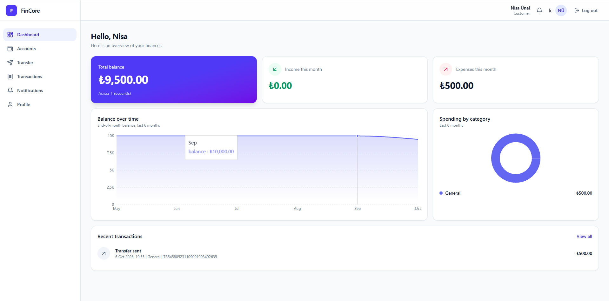

## Features

**Customers**
- Register, login, JWT access tokens with refresh token rotation, logout, password change, account lockout after repeated failed logins
- Multiple accounts (TRY / USD / EUR), balances, freeze / unfreeze
- Money transfers with validation, authorization, balance and account status checks
- **Idempotent transfers**: a retried or double-clicked request never moves money twice
- Transaction history with filtering and pagination
- Dashboard: total balance, monthly income and expenses, balance over time, spending by category (Recharts)
- Real-time notifications (RabbitMQ + SignalR)

**Admins**
- Overview with users, accounts, transaction counts, volume, failed and suspicious transactions
- Manage users (activate, deactivate, unlock), accounts (freeze / unfreeze) and browse all transactions
- Rule-based risk scoring (high amount, rapid transfers, new receiver) with a dedicated suspicious transactions view

## Tech stack

| Area | Technology |
|---|---|
| Backend | C#, .NET 8, ASP.NET Core Web API, Entity Framework Core, FluentValidation |
| Database | SQL Server (database per service), Redis |
| Messaging | RabbitMQ (async events), SignalR (real-time push) |
| Frontend | React, TypeScript, Vite, Tailwind CSS, React Router, Axios, TanStack Query, Recharts |
| Observability | Serilog, Elasticsearch |
| DevOps | Docker, Docker Compose, GitHub Actions |
| Testing | xUnit, Moq, FluentAssertions |

## Architecture

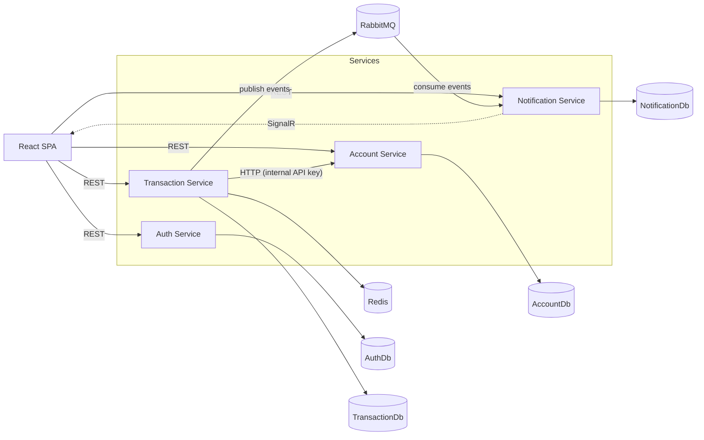

| Service | Responsibility |
|---|---|
| **Auth** | Users, JWT and refresh tokens, lockout, profile, admin user management |
| **Account** | Accounts and balances, freeze / unfreeze, atomic debit and credit |
| **Transaction** | Transfers, idempotency, risk scoring, history, statistics |
| **Notification** | Consumes events, stores notifications, pushes them with SignalR |

Services never touch each other's tables. They talk through HTTP APIs (when an immediate answer is needed) or RabbitMQ events (when it is not).

### Transfer flow

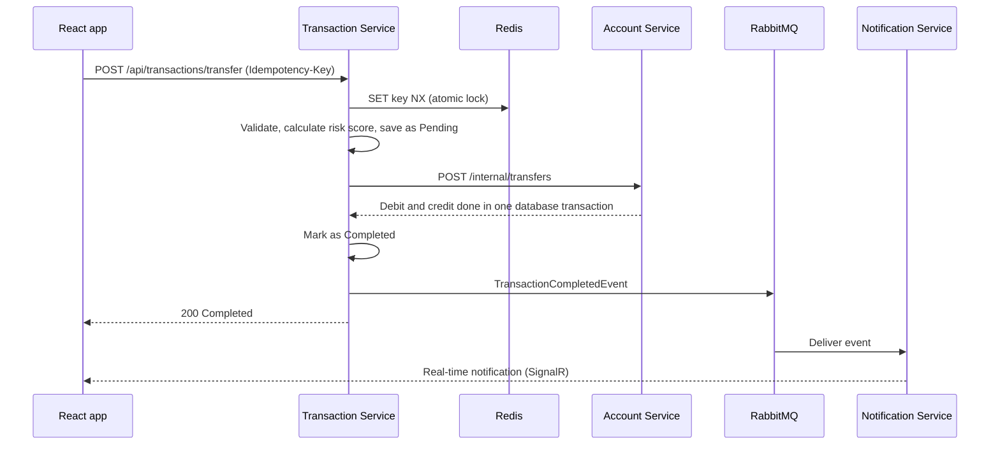

Key design decisions:
- **Idempotency in two layers**: an atomic Redis lock for concurrent requests and a unique database index as the final safety net.
- **Atomic money movement**: debit and credit happen in a single database transaction, with optimistic concurrency (row version) to prevent lost updates.
- **Failed transfers are recorded** (with the reason) so admins can review them and the risk rules can use them.
- **Events never break a transfer**: if RabbitMQ is down, the money still moves and the failure is logged.
- **Internal endpoints** are protected by an API key and are not meant for end users.

## Getting started

### Run everything with Docker

Requirements: Docker Desktop.

```bash
git clone https://github.com/nisa1283/FinCore.git
cd FinCore

cp docker/.env.example docker/.env       # Windows cmd: copy docker\.env.example docker\.env
docker compose -f docker/docker-compose.yml up -d --build
```

The first build takes a few minutes. Then open:

| What | URL |
|---|---|
| App | http://localhost:5173 |
| Auth API (Swagger) | http://localhost:5001/swagger |
| Account API (Swagger) | http://localhost:5002/swagger |
| Transaction API (Swagger) | http://localhost:5003/swagger |
| Notification API (Swagger) | http://localhost:5004/swagger |
| RabbitMQ management | http://localhost:15672 (`fincore` / `fincore_pass`) |

Databases are created and migrated automatically on startup.

**Create an admin:** register a user in the app, then promote it:

```bash
docker exec -it fincore-sql /opt/mssql-tools18/bin/sqlcmd -S localhost -U sa -P "FinCore_Pass123!" -C \
  -Q "UPDATE FinCoreAuthDb.dbo.Users SET Role = 'Admin' WHERE Email = 'you@example.com'"
```

Log in again to get a token that carries the new role.

**Optional logging stack** (Elasticsearch, needs about 4 GB of Docker memory): uncomment `ELASTICSEARCH_URL` in `docker/.env`, then:

```bash
docker compose -f docker/docker-compose.yml --profile logging up -d
```

### Run locally for development

Requirements: .NET 8 SDK, Node.js 22, Docker (for SQL Server, Redis and RabbitMQ).

```bash
docker compose -f docker/docker-compose.yml up -d sqlserver redis rabbitmq

# set the shared secrets for each service (use the same Jwt:SecretKey everywhere)
dotnet user-secrets set "Jwt:SecretKey" "<at-least-32-characters>" --project src/Services/Auth/FinCore.Auth.Api
# repeat for Account, Transaction and Notification; Account and Transaction also need InternalApi:Key

dotnet ef database update --project src/Services/Auth/FinCore.Auth.Infrastructure --startup-project src/Services/Auth/FinCore.Auth.Api
# repeat for the other services

dotnet run --project src/Services/Auth/FinCore.Auth.Api --launch-profile http
# repeat for the other services (ports 5001-5004)

cd frontend/fincore-web && npm install && npm run dev
```

### Tests

```bash
dotnet test
```

Unit tests cover successful transfers, insufficient balance, frozen accounts, duplicate (idempotent) transfers, validation, risk calculation and account lockout.

## API overview

| Service | Endpoints |
|---|---|
| Auth | `POST /api/auth/register` `login` `refresh` `logout` `change-password`, `GET/PUT /api/users/me` |
| Account | `GET/POST /api/accounts`, `GET /api/accounts/{id}`, `POST /api/accounts/{id}/freeze` `unfreeze` |
| Transaction | `POST /api/transactions/transfer` (header `Idempotency-Key`), `GET /api/transactions` (filters + paging), `GET /api/transactions/{id}`, `GET /api/transactions/summary` |
| Notification | `GET /api/notifications`, `GET /api/notifications/unread-count`, `POST /api/notifications/{id}/read` `read-all`, SignalR hub `/hubs/notifications` |
| Admin | `GET /api/admin/users`, `POST /api/admin/users/{id}/activate` `deactivate` `unlock`, `GET /api/admin/accounts`, `GET /api/admin/transactions` `suspicious` `stats` |

All responses use one envelope: `{ "success": true, "message": "...", "data": { } }`. Errors return the same shape with `errors`.

## Screenshots

| | |
|---|---|
| 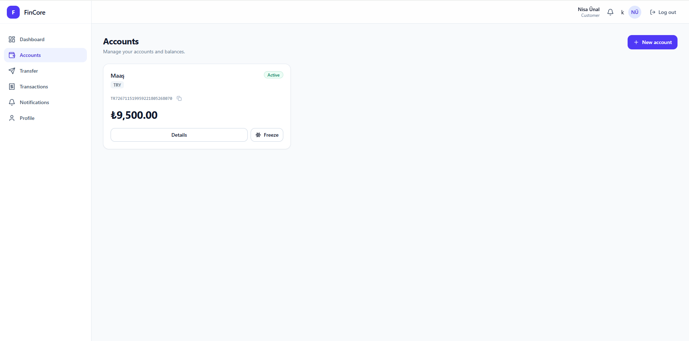 | 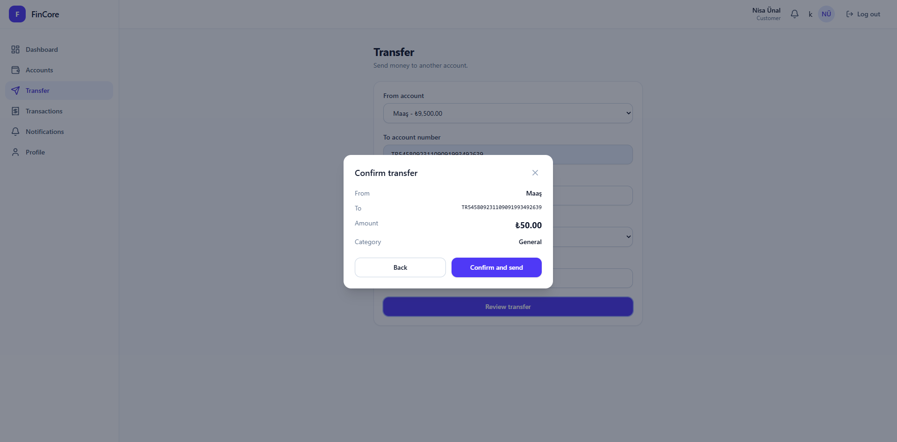 |
| 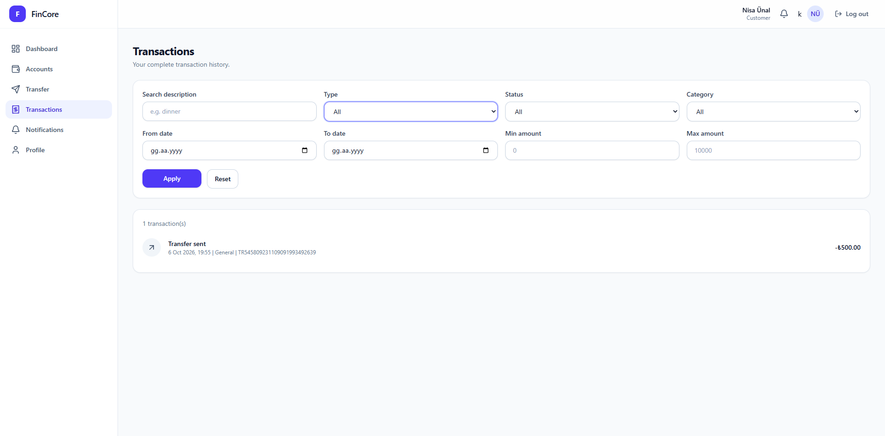 | 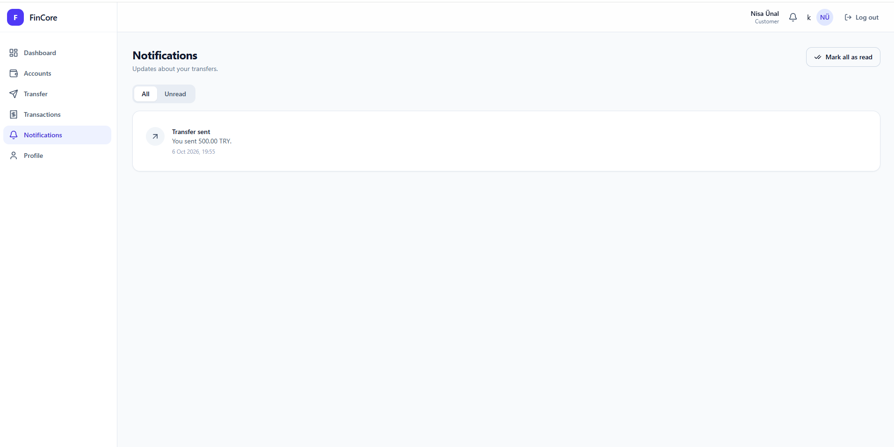 |
| 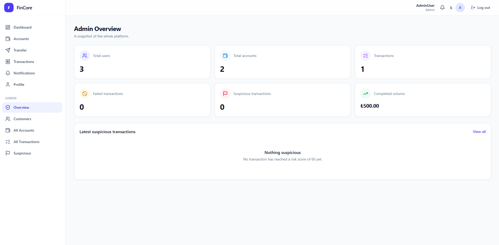 | 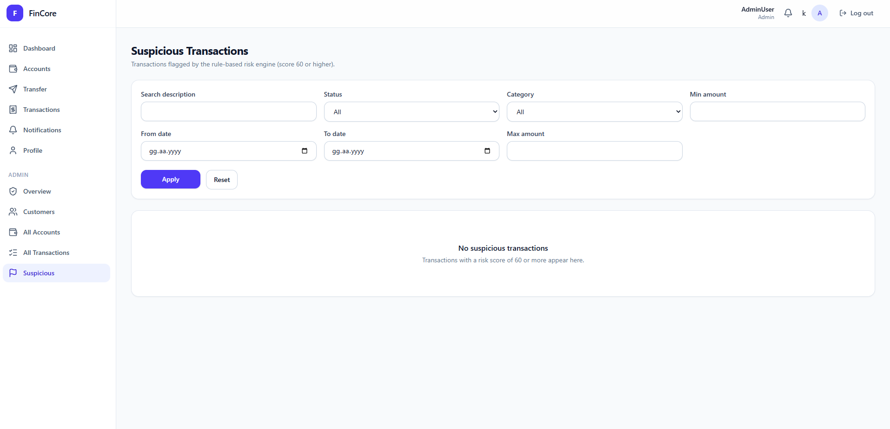 |
| 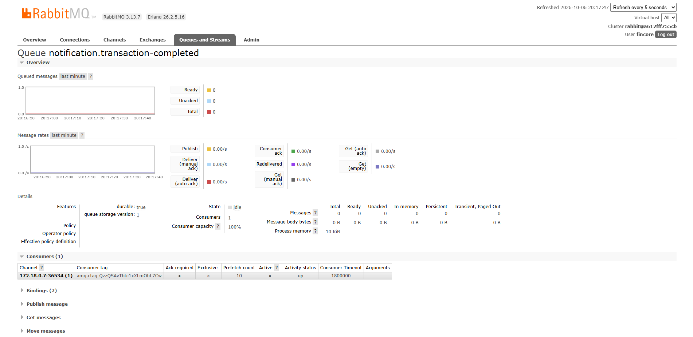 | 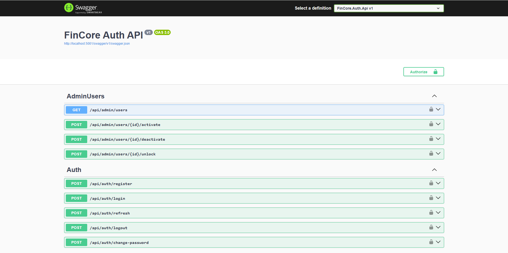 |

## Security notes

- Passwords are hashed with BCrypt. Access tokens are short lived and refresh tokens are rotated on every use.
- Accounts lock for 15 minutes after 5 failed logins. Login errors never reveal whether an email exists.
- Secrets live in `docker/.env` or user-secrets and are never committed. The values in `.env.example` are for local development only.
- Access and refresh tokens are kept in `localStorage` for simplicity. A production system should use `httpOnly` cookies.
- The frontend hides admin pages for convenience; the real protection is role-based authorization in the API.

## Known limitations and roadmap

- **Outbox pattern** for guaranteed event delivery (an event is lost if RabbitMQ is down at the moment of publishing)
- **Dead-letter queue** and retry policy for failing messages
- **Card Service** (virtual cards, limits, online payment toggle)
- **Reporting Service** with balance snapshots for exact historical balances
- **OTP verification** (Redis) and device-based risk rules
- **API gateway** (YARP) in front of the services

## Author

**Nisa Nur Unal**: [GitHub](https://github.com/nisa1283)